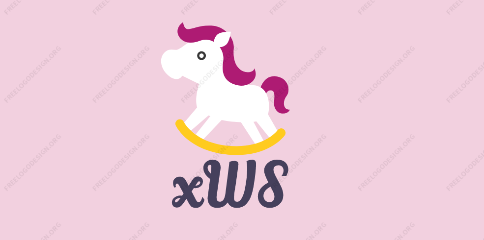
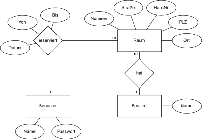

<!-- PROJECT LOGO -->

<h1 align="center">Projekt xWorkspace</h3>
 
    
  </a>
 
 

 

<!-- Inhaltsverzeichnis -->

# Inhaltsverzeichnis
1. [Roadmap](#roadmap)
2. [ER Modell](#er-modell)
3. [Relationaler DB-Entwurf](#relationaler-datenbank-entwurf)
4. [Erstellt mit](#erstellt-mit)

 

<!-- Content -->

## Roadmap

 

- [x] Browser Login
- [x] Räume reservieren
- [x] Passwortabfrage mit Weiterleitung
- [x] Kalender mit Terminen
- [x] Prototyp mit Login, Startseite und Raumreservierung
- [x] Erstellung zugehöriger Datenbank
- [x] Implementierung von Datenbank in das xWS Tool
- [x] Verfügbarkeiten und eigene Termine anzeigen lassen
- [x] Raumsuche nach Datum und Zeit
- [x] Designänderungen
- [ ] Buchung stornieren
    

(<a href="#top">nach oben</a>)

## ER Modell

 

    

(<a href="#top">nach oben</a>)

## Relationaler Datenbank Entwurf

 

Benutzer(**ID**, Name, Password) 
Raum(**ID**, Nummer, Straße, HausNr, Ort, PLZ) 
Feature(**ID**, Name)

Raum_Feature(**ID**, <ins>RaumID</ins>, <ins>FeatureID</ins>) 
Reservierung(**ID**, <ins>BenutzerID</ins>, <ins>RaumID</ins>, Von, Bis, Datum)

(<a href="#top">nach oben</a>)

## Erstellt mit

 

- [Bootstrap](https://getbootstrap.com)
- [Vue.js](https://vuejs.org/)

(<a href="#top">nach oben</a>)

## UI/UX Prototyp

https://www.figma.com/file/C9jDSH8pYWVMZhPsl88JDO/xWorkspace?node-id=0%3A1